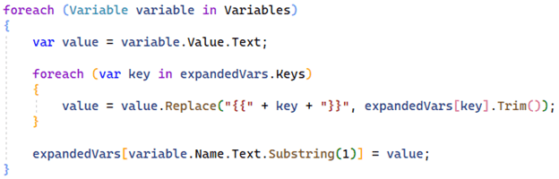
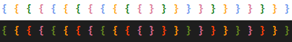
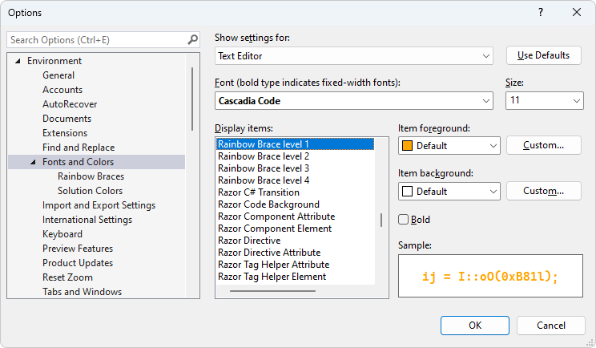
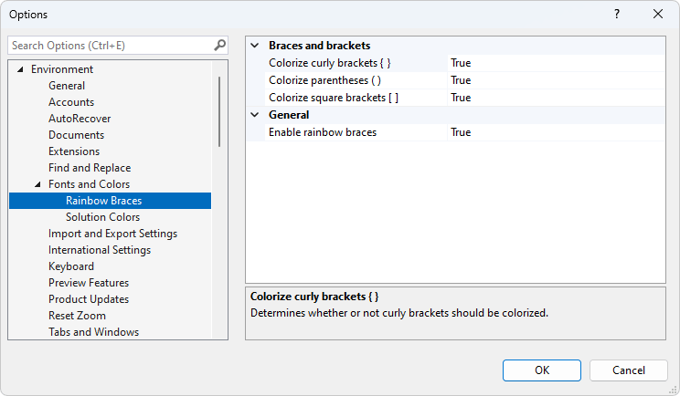

[marketplace]: https://marketplace.visualstudio.com/items?itemName=MadsKristensen.RainbowBraces
[vsixgallery]: http://vsixgallery.com/extension/RainbowBraces.1dff1bc5-a8e4-477b-9054-2b9ec6bb88d1/
[repo]:https://github.com/madskristensen/RainbowBraces

# Rainbow Braces for Visual Studio

Download this extension from the [Visual Studio Marketplace][marketplace]
or get the [CI build][vsixgallery].

----------------------------------------

Colorizes matching brace pairs to make it easy to identify them and their scope. Works for curly brackets, parentheses, and square brackets. Inspired by the [Bracket pair colorization](https://developercommunity.visualstudio.com/t/Bracket-pair-colorization/1631048?space=8&ftype=idea&q=brackets) feature request for Visual Studio (please go vote for it).

Both light and dark themes are supported.

To toggle the brace colorization on and off, a menu item is available under the **Edit -> Advanced** menu or using the shortcut **Ctrl+Shift+9**.

You can customize the colors from the **Tools -> Options** dialog.

There are also a few other specific options available under the **Fonts and Colors** tree node.

For more advanced features, I recommend the free [Viasfora extension](https://marketplace.visualstudio.com/items?itemName=TomasRestrepo.Viasfora) by [Tomas Restrepo](https://twitter.com/tomasrestrepo).

## How can I help?
If you enjoy using the extension, please give it a ★★★★★ rating on the [Visual Studio Marketplace][marketplace].

Should you encounter bugs or if you have feature requests, head on over to the [GitHub repo][repo] to open an issue if one doesn't already exist.

Pull requests are also very welcome, since I can't always get around to fixing all bugs myself. This is a personal passion project, so my time is limited.

Another way to help out is to [sponsor me on GitHub](https://github.com/sponsors/madskristensen).